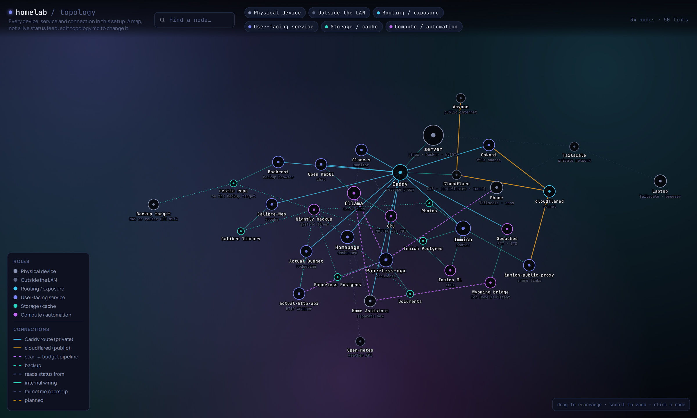
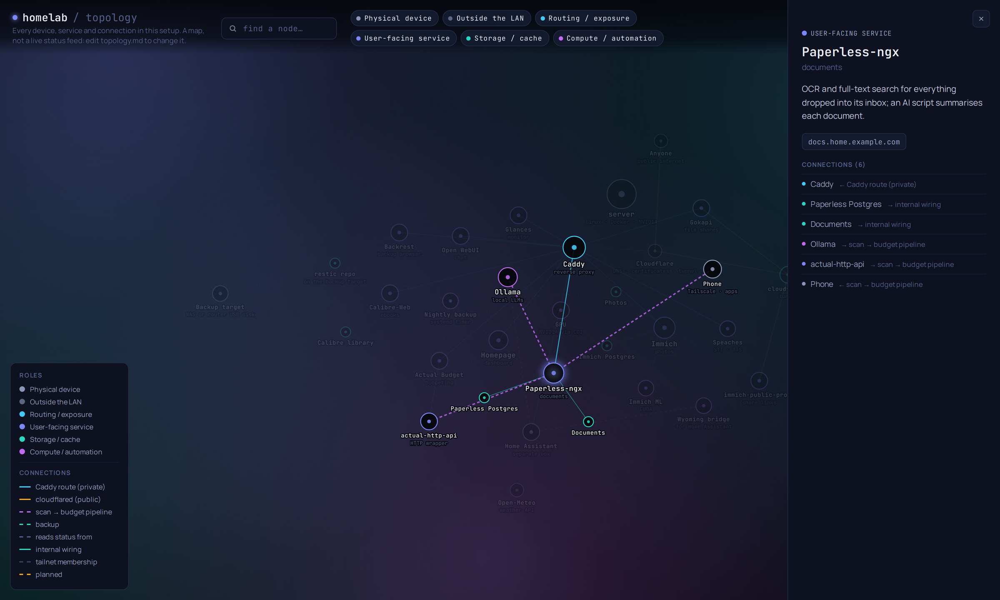

# homelab

My self-hosted setup: photos, documents, budgeting, local AI, file sharing,
ebooks and backups on one Linux machine. There's a guided installer that
checks the machine first, asks a few questions and generates passwords
itself.

> **This is a personal setup, shared as-is.** It's what runs on my own
> server, published so I can rebuild it on a new machine, and in case it's
> useful to someone else. The choices are opinionated (Tailscale for
> private access, Cloudflare for DNS and public links, Debian/Ubuntu based system,
> NVIDIA's GPU), some parts are tuned to my life (the Paperless
> receipt pipeline expects EUR), and there's no support or roadmap beyond
> what I need. Issues and ideas are welcome; just set expectations
> accordingly.


<sub>The built-in topology map (`map.` hostname) with the example data: private routes in blue, public tunnel in orange, pipelines in purple, backups in teal.</sub>

## What you get

| Stack | What it is | Address | Profile |
|---|---|---|---|
| `caddy` | Reverse proxy, one wildcard HTTPS certificate | | always |
| `homepage` | Dashboard with a live tile per service | `dash.` | minimal |
| `glances` | CPU, memory, disk, network, GPU monitor | `glances.` | minimal |
| `immich` | Photo and video library, phone backup | `photos.` | standard |
| `paperless-ngx` | Scanned documents: OCR, search, auto-filing | `docs.` | standard |
| `actual-budget` | Envelope budgeting, plus an HTTP API wrapper | `budget.` | standard |
| `gokapi` | Expiring file shares | `files.` (public: `send.`) | standard |
| `calibre-web` | Ebook library in the browser, with an import folder ([Calibre-Web Automated](https://github.com/crocodilestick/calibre-web-automated)) | `books.` | standard |
| `anki` | Anki sync server, so flashcards sync without AnkiWeb | `anki.` | standard |
| `dawarich` | Location history and walk maps (a Google Timeline replacement) | `timeline.` | full |
| `backrest` | Browse and restore the nightly backups | `backrest.` | standard |
| `ollama` | Local LLMs with the Open WebUI chat | `ai.` | full |
| `speech` | Speech to text and text to speech (OpenAI API, Home Assistant) | `speech.` | full |
| `immich-public-proxy` | Public Immich share links, nothing else | public: `share.` | full |

Plus a topology map (`map.`), optional nightly backups (restic plus
database dumps, to a local disk or an SMB share), and optional Home
Assistant integration (HTTPS route, dashboard tile, Ollama and speech for
its voice assistant).

## How it fits together

```
 your devices ──Tailscale──▶ *.home.example.com ──▶ Caddy ──▶ each app       (private)
 anyone ──▶ share./send.example.com ──▶ Cloudflare Tunnel ──▶ one app port   (public)
```

Click any node on the map to see what it does and what it talks to; here,
the document pipeline: a phone scan lands in Paperless, Ollama summarises
it, and receipts flow on to Actual Budget.



- **Private by default.** Every web UI is `<name>.home.example.com`. A
  wildcard DNS record points at the server's **Tailscale** IP, so these
  names only work on your tailnet. Caddy gets one wildcard certificate via
  Cloudflare DNS-01: real HTTPS, no ports opened on your router, and no
  individual hostnames in certificate transparency logs.
- **Public on purpose, per service.** The two things meant for other people
  (Immich shared links and Gokapi downloads) get flat public hostnames
  (`share.example.com`, `send.example.com`) through a **Cloudflare Tunnel**.
  The tunnel forwards straight to one loopback port, not through Caddy, and
  `immich-public-proxy` only ever serves shared links, never the login or
  library. See [docs/public-exposure.md](docs/public-exposure.md).
- **No accounts at all** for trying it out: `TLS_MODE=internal` uses Caddy's
  own certificate authority instead (this is what the automated tests use).

## Quick start

On the server (Debian 12+ or Ubuntu 22.04+, see
[docs/machines.md](docs/machines.md) for what to prepare):

```bash
git clone https://github.com/<you>/homelab.git ~/homelab
cd ~/homelab
./install.sh            # questions, checks, then everything starts
```

Or check a machine first without changing anything:

```bash
./install.sh --check --profile full
```

Or set up **another machine from your laptop** over SSH (the repo is copied
there and the installer runs in your terminal):

```bash
./install.sh --host you@server
./install.sh --host you@server --config my-homelab.env --yes   # no questions
```

What the installer does:

1. **Checks the machine**: OS, systemd, sudo, Docker Engine and Compose
   version, docker group, RAM and disk for the stacks you picked, port 443,
   clock sync, NVIDIA driver, container toolkit and CDI (if you use the
   GPU), Tailscale, Cloudflare token and DNS, restic and cifs-utils for
   backups. Each problem comes with its fix, and it offers to apply the safe
   ones itself (install Docker Engine, packages, docker group).
2. **Asks what you want** (whiptail menus, or plain prompts): stacks, HTTPS
   mode and domain, timezone, GPU, folders, public links, Paperless AI,
   Home Assistant, backups. Answers go to `homelab.env`.
3. **Generates config**: random secrets in `stacks/*/.env` (mode 600), Caddy
   routes and dashboard tiles for exactly the enabled stacks, tunnel
   ingress, backup units.
4. **Starts everything**, installs the backup timer, waits for health
   checks, runs `lab doctor`, and prints your URLs and the first-login
   steps for each app.

Re-running it is safe: it keeps `homelab.env`, every generated secret and
all data. `./install.sh --reconfigure` asks the questions again.

**Lost the machine?** With the backups and the restic password,
`./install.sh --from-backup //nas/Backup` rebuilds it in one go: settings,
secrets, the private overlay, every stack and all the data (tested end to
end in a VM, see [extras/backup](extras/backup/README.md#rebuilding-a-machine-from-its-backups)).
Moving data into a machine you've already set up: `./lab restore`.

| Option | |
|---|---|
| `--check` | Only check this machine; change nothing |
| `--profile minimal\|standard\|full` | Preselect stacks (default: standard) |
| `--stacks a,b,c` | Exactly these stacks (caddy is implied) |
| `--config FILE` / `--yes` | Use FILE as `homelab.env`; ask nothing |
| `--reconfigure` | Ask the setup questions again |
| `--dry-run` | Check and generate config, start nothing |
| `--no-start` | Everything except starting containers |
| `--host USER@HOST [--dir PATH]` | Do all of this on another machine over SSH |
| `--backup` / `--public` | Only (re)install the backup timer / tunnel config |
| `--uninstall` | Stop containers and remove timers; keeps all data |
| `--from-backup SOURCE` | Rebuild this machine from its backups (folder or `//server/share`) |
| `--force` | Continue even if checks fail |

## Day to day: `lab`

```
lab ls                      all stacks, on/off, with descriptions
lab status                  running containers
lab up [stack...]           (re)generate config and start
lab down | stop | restart [stack...]
lab pause                   stop only heavy services (ML, OCR, LLMs)
lab pause --all / resume    stop everything / start it again
lab logs <stack> [service]
lab update [stack...]       pull new images and recreate
lab enable | disable <stack>
lab doctor                  containers healthy? routes answering? GPU? backups?
lab config <stack> <KEY>    set a value in a stack's .env (hidden input)
lab secret <stack> <KEY>    print one (e.g. a generated admin password)
lab keys [--long] [stack]   which keys each .env has, set or empty, what they're for
lab backup now | status | log
lab restore [--dry-run]     bring data back from the backups
lab compose <stack> ...     any docker compose command with lab's files
```

`./install.sh` offers to link `lab` into `~/.local/bin`.

## Configuration

- **`homelab.env`**: every global setting (domain, stacks, folders, GPU,
  backups...). Written by the wizard; documented line by line in
  [homelab.env.example](homelab.env.example). After editing: `lab up`.
- **`stacks/<name>/.env`**: that stack's secrets, generated on first render
  and never overwritten. Change one with `lab config`. Every key is
  documented in `stacks/<name>/.env.example` (the comment above it starts
  with `Generated.` when lab makes the value, `Managed:` when `lab render`
  rewrites it); `lab keys` lists them without showing values.
- **`stacks/<name>/`**: `compose.yml` (all machine-specific values are
  `${VARIABLES}` from `homelab.env`), `stack.conf` (description, hostname,
  needs, secrets, backup paths), `caddy.conf` (its route), `homepage.yaml`
  (its tile), and optional overlays like `gpu.yml` that `lab` adds only when
  their switch is on.
- **Generated, never edit**: `rendered/` (Caddy config, tunnel config,
  backup units, topology map) and `stacks/homepage/config/`.

Adding a stack: copy a small one (`stacks/gokapi` is a good template),
adjust the files above, `lab enable <name> && lab up <name>`.

## More

- [docs/machines.md](docs/machines.md): every machine involved (server,
  laptops, phone, Home Assistant box, backup target) and what to install on
  each, including the NVIDIA GPU setup and remote installs.
- [docs/public-exposure.md](docs/public-exposure.md): the public-links layer
  and the Cloudflare side of it.
- [docs/private-overlay.md](docs/private-overlay.md): your machine-specific
  extras (tiles, routes, pages, your real map) in a private folder.
- [docs/troubleshooting.md](docs/troubleshooting.md): problems that have
  actually happened, and their fixes.
- [extras/backup](extras/backup/README.md),
  [extras/paperless-ai](extras/paperless-ai/README.md),
  [extras/homeassistant](extras/homeassistant/README.md),
  [extras/topology](extras/topology/README.md).
- [tests/](tests/README.md): the installer is tested end to end in a
  throwaway VM (`tests/vm.sh all`).

## Layout

```
install.sh            setup, checks, remote install
lab                   day-to-day management
homelab.env.example   every setting, documented
lib/                  shared bash: checks, wizard, render, doctor, remote
stacks/<name>/        one folder per compose project
extras/               backup, paperless-ai, homeassistant, topology
docs/                 machines, public exposure, troubleshooting
tests/                VM end-to-end test
```

## Security notes

- Secrets live only in `homelab.env`, `stacks/*/.env` (both gitignored,
  mode 600) and root-only files under `/etc/homelab`. Nothing sensitive is
  committed.
- No ports are published on `0.0.0.0` except Caddy's 443. Host-level ports
  bind to `127.0.0.1`; Ollama and the speech bridge bind to your LAN address
  only if you ask for it (they have no authentication).
- Glances gets a read-only Docker socket and the host PID namespace (its
  documented requirements); that is the only container with Docker access.

## License

MIT, see [LICENSE](LICENSE). The apps themselves are under their own licenses.
